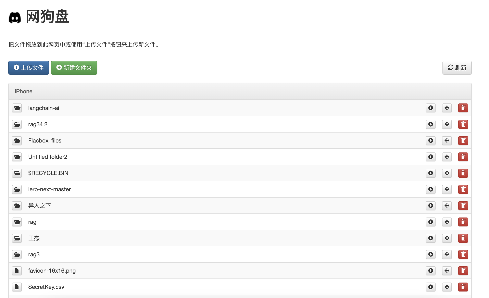

# pydog
网购盘python版本



1. 初始化 python 虚拟环境: 
   * `python3 -m venv rag-ai/venv`
2. 并切换到当前环境, windows 下自行google。
   * `cd rag-ai && source ./venv/bin/activate`
3. 安装依赖
   * `pip config set global.index-url https://mirrors.cloud.tencent.com/pypi/simple/`
   * `pip install fastapi`
   * `pip install python-multipart`
   * `pip install jinja2`
   * `pip install uvicorn[standard]`
4. 启动应用: 
   * `uvicorn main:app --host 0.0.0.0 --timeout-keep-alive 60 --workers 8`


系统变量:
```
root_path: 根目录
username: 用户名
password: 密码
```

附:

依赖管理:
```
# 安装依赖
pip install -r requirements.txt
# 生成依赖描述文件
pip freeze > requirements.txt
```